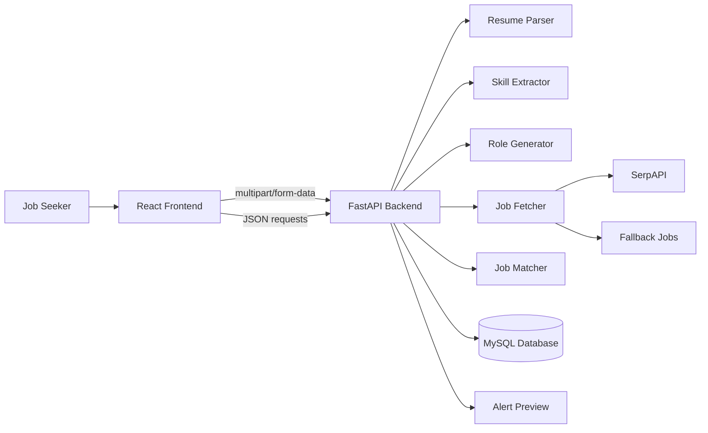
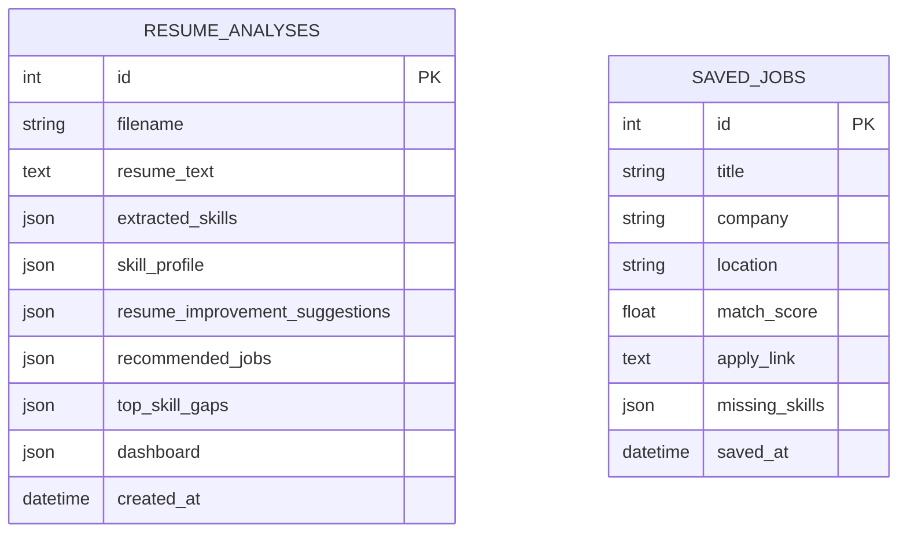
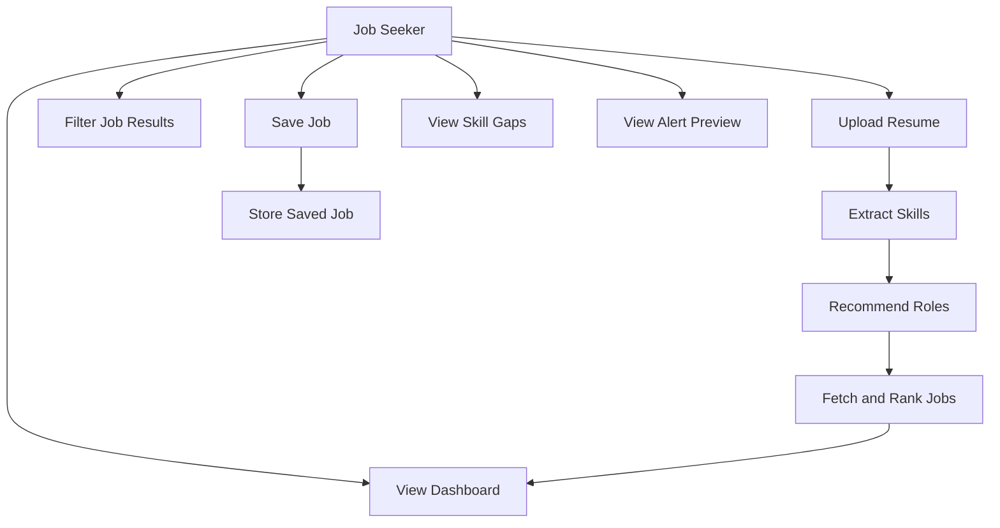
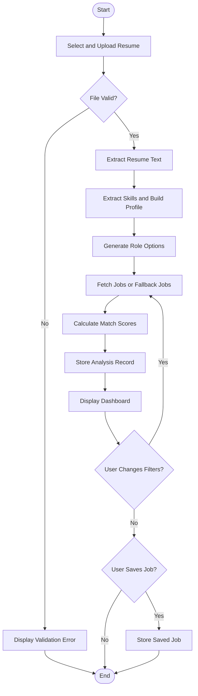
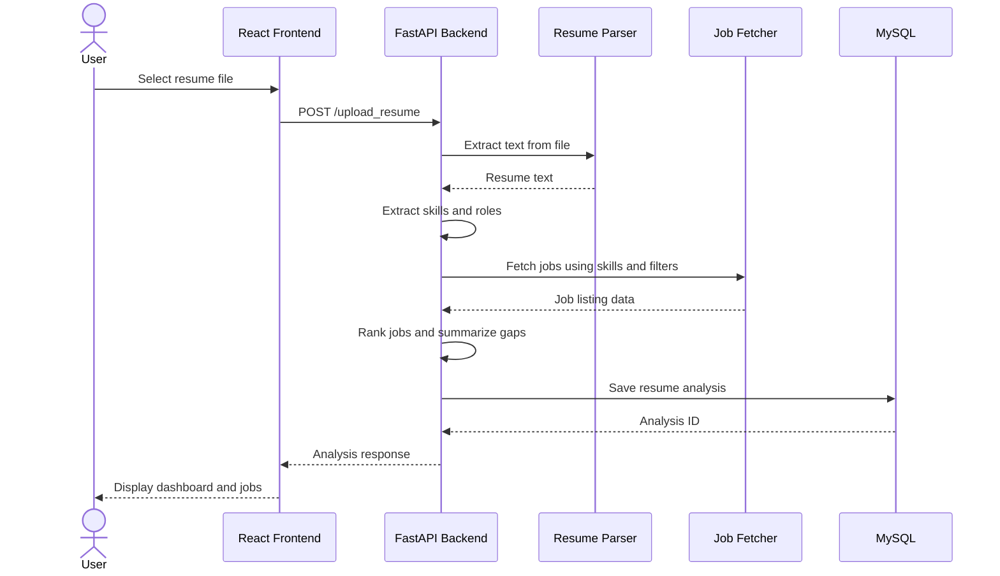

# Software Requirements Specification (SRS)

## AI Resume Based LinkedIn Job Finder

Prepared By: Project Team  
Department Name: Computer Science / Information Technology  
Institution Name: Academic Project Submission  
Date: 13 May 2026  
Version: 1.0

### Project Description

AI Resume Based LinkedIn Job Finder is a full-stack web application designed to assist job seekers in finding suitable job opportunities based on the actual content of their resume. The system accepts a resume file, extracts text and technical skills, recommends suitable roles, searches for job listings, ranks jobs by relevance, identifies skill gaps, and presents results through a structured dashboard. The application reduces manual job comparison effort and provides a focused, resume-driven job discovery workflow.

### Technology Stack

| Layer | Technology |
|---|---|
| Frontend | React JS, Vite, Lucide React, HTML, CSS |
| Backend | Python, FastAPI, Uvicorn, Pydantic |
| Database | MySQL, SQLAlchemy, PyMySQL |
| Tools/Libraries | SerpAPI, pdfplumber, python-docx, spaCy, sentence-transformers, scikit-learn |

### Main Modules

- Resume Upload and Skill Extraction
- Job Search and Match Ranking
- Dashboard, Filters, and Skill Gap Analysis
- Saved Jobs and Job Alerts

## Contents

1. Introduction  
   1.1 Purpose  
   1.2 Project Overview  
   1.3 Scope of the Project  
   1.4 Objectives  
   1.5 Definitions, Acronyms and Abbreviations  
   1.6 References  
2. Overall Description  
   2.1 System Perspective  
   2.2 System Features  
   2.3 User Classes and Characteristics  
   2.4 Operating Environment  
   2.5 Design and Implementation Constraints  
   2.6 Assumptions and Dependencies  
3. Problem Statement  
4. Functional Requirements  
5. Non-Functional Requirements  
6. System Architecture  
7. Database Design  
8. API Specifications  
9. User Interface Design  
10. Use Case Diagrams  
11. Activity and Sequence Diagrams  
12. Testing Requirements  
13. Deployment Requirements  
14. Project Planning and Timeline  
15. Future Enhancements  
16. Risk Analysis  
17. Conclusion  
18. Appendix

## 1. Introduction

### 1.1 Purpose

The purpose of this Software Requirements Specification is to define the functional, non-functional, interface, data, testing, and deployment requirements for the AI Resume Based LinkedIn Job Finder project. This document provides a common understanding of the expected system behavior for developers, testers, project evaluators, and academic stakeholders.

The SRS also acts as a reference for implementation and validation. It describes what the system shall do, what constraints shall be followed, how data shall be handled, and how the user shall interact with the application. The document does not describe every internal algorithm in mathematical detail, but it provides enough specification for development, testing, review, and future enhancement.

### 1.2 Project Overview

The project is a resume-first job recommendation system. Instead of asking the user to manually search through large numbers of job postings, the application begins with the user's resume and uses it as the primary input for job discovery. The system extracts resume text, detects relevant skills, prepares a skill profile, infers appropriate job roles, and retrieves job opportunities from external search sources when available.

The backend ranks job listings using skill overlap and semantic relevance. The frontend displays the result as a dashboard containing extracted skills, recommended jobs, match scores, missing skills, filter controls, saved jobs, and alert preview information. The system is intended for academic demonstration and practical local use, while keeping the design extensible for production-level features such as authentication, email alerts, and advanced resume scoring.

### 1.3 Scope of the Project

The scope of the project includes resume upload, file validation, text extraction, skill identification, job role recommendation, job retrieval, job ranking, dashboard display, job filtering, skill gap analysis, saved job management, and alert preview. The system supports common resume formats such as PDF, DOCX, and TXT. It is also designed to remain usable when external job search APIs are not configured by returning fallback recommendations.

The current version does not include full user account management, payment features, real-time notifications, employer-side job posting, or automated job application submission. These features are considered outside the initial scope and may be added in future versions. The project focuses on delivering a reliable, understandable, and testable resume-based job recommendation workflow.

### 1.4 Objectives

- To provide a web-based platform that recommends jobs based on resume content.
- To extract and organize technical skills from uploaded resume files.
- To identify role options that match the user's demonstrated skill set.
- To retrieve and rank job listings according to resume relevance.
- To show match scores, matched skills, and missing skills for each job.
- To provide skill gap and resume improvement suggestions.
- To allow users to save selected jobs for later review.
- To maintain clear separation between frontend, backend, database, and external API responsibilities.

### 1.5 Definitions, Acronyms and Abbreviations

| Term | Description |
|---|---|
| API | Application Programming Interface used for communication between software components |
| DBMS | Database Management System used to store and manage application data |
| NLP | Natural Language Processing, used for analyzing resume text and job descriptions |
| Resume Parser | Component that extracts readable text from PDF, DOCX, or TXT files |
| Skill Extraction | Process of identifying technical and professional skills from resume text |
| Match Score | Numeric score representing how strongly a job matches the user's resume |
| Skill Gap | Skill required or preferred by a job but not detected in the uploaded resume |
| SerpAPI | External search API used for retrieving job listing data |
| Fallback Job | Locally generated job recommendation used when external API access fails |
| CORS | Cross-Origin Resource Sharing policy used for browser-to-backend communication |

### 1.6 References

- Backend files: `backend/main.py`, `resume_parser.py`, `skill_extractor.py`, `job_fetcher.py`, `job_matcher.py`, `database.py`
- Frontend files: `frontend/src/main.jsx`, `frontend/src/styles.css`
- Dependency files: `backend/requirements.txt`, `frontend/package.json`
- FastAPI official documentation for REST API development
- React and Vite documentation for frontend development
- SQLAlchemy and MySQL documentation for persistence design
- SerpAPI documentation for job search integration

## 2. Overall Description

### 2.1 System Perspective

The AI Resume Based LinkedIn Job Finder is an independent web application composed of a React frontend, FastAPI backend, MySQL database, and optional external job search integration. The frontend provides user interaction and dashboard visualization. The backend performs resume processing, skill analysis, job retrieval, ranking, and data persistence. The database stores resume analysis records and saved job bookmarks.

The system follows a client-server architecture. The frontend communicates with the backend using HTTP requests and JSON responses. Resume upload is handled through multipart form data. External job search is performed through SerpAPI when an API key is available. If the external dependency is unavailable, the backend generates fallback jobs so that the main user workflow remains demonstrable and testable.

### 2.2 System Features

- Resume Upload: Users can upload resumes in supported formats through the web interface.
- File Validation: The backend checks file presence, file type, and parseability before analysis.
- Text Extraction: Resume text is extracted using appropriate parsing methods for each file type.
- Skill Extraction: Technical skills are detected from resume content and grouped into a profile.
- Role Recommendation: The system suggests suitable job roles based on extracted skills.
- Job Fetching: Jobs are retrieved using configured search parameters and location preferences.
- Job Ranking: Listings are scored using skill matching and relevance logic.
- Skill Gap Analysis: Missing skills are summarized from recommended jobs.
- Dashboard Display: Users can view metrics, skills, jobs, gaps, filters, and alerts in one place.
- Saved Jobs: Users can bookmark jobs with their match score and missing skills.

### 2.3 User Classes and Characteristics

| User Type | Characteristics | Responsibilities |
|---|---|---|
| Job Seeker | Primary user with basic web knowledge | Upload resume, review recommendations, filter jobs, save useful listings |
| Developer/Admin | Technical user maintaining the system | Configure environment variables, database, API keys, CORS, and deployment settings |
| Tester | User responsible for quality verification | Validate file handling, API responses, UI behavior, and error cases |
| Evaluator | Academic reviewer or project guide | Assess completeness, documentation quality, usability, and implementation correctness |

### 2.4 Operating Environment

The frontend runs in a modern web browser and is served through Vite during development. The backend runs on Python using FastAPI and Uvicorn. MySQL is the preferred persistent database, accessed through SQLAlchemy and PyMySQL. The application can be developed on Windows using PowerShell and can be adapted for Linux-based deployment environments.

During local development, the frontend generally runs at `http://localhost:5173` and the backend runs at `http://localhost:8000`. The backend exposes REST endpoints for resume analysis, job retrieval, skill gap reporting, saved job storage, and job alert preview. The system requires internet access for live job search through SerpAPI, but its fallback logic allows offline or API-limited demonstrations.

### 2.5 Design and Implementation Constraints

- The system shall support PDF, DOCX, and TXT resume uploads only.
- The backend shall reject empty files and unsupported file types.
- Environment-specific values such as `MYSQL_URL`, `SERPAPI_API_KEY`, and CORS origins shall be configured outside source code.
- The frontend shall use the configured API base URL to communicate with the backend.
- The backend shall return structured JSON responses suitable for direct frontend rendering.
- The ranking logic shall be understandable and testable for academic evaluation.
- The application shall avoid unnecessary complexity in Version 1.0 while remaining extensible.

### 2.6 Assumptions and Dependencies

It is assumed that users upload resumes containing readable text rather than scanned images. The system depends on third-party parsing libraries for resume extraction, and parsing accuracy may vary depending on formatting. Live job retrieval depends on the availability and configuration of SerpAPI. Database persistence depends on a reachable MySQL server and valid connection string.

It is also assumed that the user has basic familiarity with uploading files and reviewing web dashboard results. Developers are expected to install Python dependencies, frontend dependencies, and configure environment variables correctly. Optional NLP libraries may improve ranking quality, but the system should continue functioning gracefully if optional models are unavailable.

## 3. Problem Statement

### 3.1 Existing System

Most job seekers use general job portals by entering keywords, manually opening listings, reading descriptions, and comparing them with their resume. These platforms provide large volumes of search results, but the relevance of each result is not always clear to the user. Users must manually determine whether their skills match the requirements of each posting.

Existing systems may provide filters such as location, experience level, job title, and company name, but they often do not analyze the user's resume deeply. As a result, the user may spend significant time reviewing jobs that are too advanced, unrelated, or missing critical skill alignment. Skill gap identification is also mostly manual.

### 3.2 Problems Identified

- Job search requires repeated manual keyword entry and comparison.
- Users cannot easily know which jobs match their current resume skills.
- Missing skills are not summarized in a clear and actionable manner.
- Relevant jobs can be lost if the user does not save them separately.
- External job APIs may fail or be unavailable during demonstrations.
- Resume improvement suggestions are usually separate from job search workflows.
- A beginner user may find it difficult to interpret large job listing volumes.

### 3.3 Proposed Solution

The proposed system uses the resume as the starting point of the job search. It automatically extracts skills, suggests roles, fetches jobs, ranks recommendations, and presents skill gaps in one dashboard. This approach reduces manual effort and gives the user a focused view of opportunities that are more likely to match their current profile.

The solution also improves demonstration reliability by including fallback jobs when the external API is unavailable. The dashboard provides practical outputs such as match score, matched skills, missing skills, role filters, country/location options, saved jobs, and resume suggestions. The system therefore combines resume analysis and job recommendation into a single academic full-stack application.

## 4. Functional Requirements

### 4.1 Module 1: Resume Upload and Skill Extraction

This module is responsible for accepting resume files, extracting text, identifying technical skills, and preparing the initial analysis record.

- The system shall provide a resume upload control on the frontend.
- The system shall accept PDF, DOCX, and TXT files as valid resume formats.
- The system shall reject empty files and return a meaningful validation error.
- The system shall reject unsupported file types before analysis.
- The backend shall extract readable text from the uploaded resume using file-specific parsing logic.
- The system shall identify technical skills such as Python, JavaScript, React, SQL, FastAPI, Docker, AWS, machine learning, and related terms.
- The system shall build a skill profile that groups extracted skills into useful categories.
- The system shall infer role options from the detected skills, such as frontend developer, backend developer, full-stack developer, or data-focused roles.
- The system shall store the analysis data with a unique analysis identifier.
- The system shall return extracted skills, role options, country options, suggestions, recommended jobs, and dashboard data to the frontend.

### 4.2 Module 2: Job Search and Match Ranking

This module retrieves job opportunities and ranks them according to the user's resume profile.

- The system shall search for jobs using extracted skills, selected role, selected country, and location.
- The system shall use SerpAPI for live job search when `SERPAPI_API_KEY` is configured.
- The system shall use fallback job data if the external API is missing, limited, or unavailable.
- The backend shall normalize job records into a consistent structure for frontend rendering.
- The system shall calculate a match score for each job using skill overlap and relevance.
- The system shall identify matched skills found in both resume and job requirements.
- The system shall identify missing skills that appear important for the job but are absent from the resume.
- The system shall sort jobs by match score and return the top ranked results.
- Each job result shall contain title, company, location, description, source, apply link, match score, matched skills, and missing skills.
- The system shall support job refresh when the user changes role, country, or location filters.

### 4.3 Module 3: Dashboard, Filters, and Data Management

This module presents analysis results and allows users to manage job recommendations.

- The system shall display summary metrics such as jobs found, average match score, top role, and alert status.
- The dashboard shall show extracted skills and categorized skill profile information.
- The dashboard shall display ranked job cards in a readable and scannable layout.
- The user shall be able to update role, country, and location filters.
- The system shall call the backend to refresh jobs based on the selected filters.
- The system shall preserve the analysis identifier so that refresh operations use the correct resume data.
- The user shall be able to save a recommended job from the job card.
- Saved jobs shall include title, company, location, match score, apply link, missing skills, and saved timestamp.
- The system shall display saved jobs in newest-first order.
- The frontend shall show success and error messages for important user actions.

### 4.4 Module 4: Skill Gap, Suggestions, and Job Alerts

This module provides supporting intelligence for improving the user's job readiness.

- The system shall summarize the most frequent missing skills from recommended jobs.
- The system shall provide resume improvement suggestions based on resume content and extracted skills.
- The system shall identify improvement areas such as missing project details, measurable achievements, profile links, or stronger technical keywords.
- The system shall expose a skill gap API endpoint for retrieving gaps and suggestions by analysis identifier.
- The system shall provide a job alert preview endpoint showing alert status, frequency, next run hint, and recommended alert jobs.
- The current version shall show daily alert preview information without sending actual emails.
- The module shall support future extension for scheduled notifications and user-specific alert preferences.
- Skill gap and alert information shall be presented in the dashboard in a concise and actionable manner.

## 5. Non-Functional Requirements

### 5.1 Performance Requirements

The system should process a standard text-based resume within an acceptable response time for interactive use. Resume parsing, skill extraction, job retrieval, and ranking should be completed without causing the frontend to become unresponsive. The backend should limit the returned job list to a practical number of top recommendations so that the dashboard remains fast and readable.

External API calls may introduce latency. Therefore, the system shall handle external delays gracefully and shall not permanently block the user workflow. Fallback job generation should allow the application to provide demonstrable output even when live job retrieval is slow or unavailable.

### 5.2 Security Requirements

The system shall not hardcode API keys, database passwords, or deployment secrets in source code. Sensitive configuration values shall be provided through environment variables. The backend shall validate uploaded files before parsing and shall return safe error messages that do not expose internal stack traces to the user.

CORS settings shall be explicitly configured for trusted frontend origins during development and deployment. Saved job requests shall be validated using structured request models. In future versions with authentication, user-specific data shall be protected by login sessions or token-based authorization.

### 5.3 Reliability Requirements

The system shall continue operating under common failure conditions such as missing SerpAPI key, unavailable MySQL server, unsupported resume format, empty file upload, or invalid analysis identifier. These conditions shall produce clear messages or fallback behavior rather than application crashes.

Database operations should use SQLAlchemy with connection health checks. If database access fails during local development, fallback in-memory storage may be used to keep the demonstration workflow available. API endpoints shall return appropriate HTTP status codes for invalid input and missing records.

### 5.4 Usability Requirements

The user interface shall be simple enough for a job seeker to use without technical training. The upload action, dashboard metrics, filters, ranked job cards, saved jobs, and skill gap sections shall be clearly organized. Important states such as loading, success, and error messages shall be visible.

The layout shall be responsive for desktop and smaller screens. Text inside buttons, cards, and panels shall remain readable without overlap. Job recommendations shall be presented with practical details such as match score, company, location, missing skills, and apply link so the user can quickly decide which jobs to pursue.

### 5.5 Maintainability Requirements

The backend shall maintain clear modular separation. Resume parsing, skill extraction, job fetching, job matching, database access, and API routing shall remain in separate files or components. This structure makes the code easier to test, debug, and extend.

The frontend shall keep user interaction logic organized around upload, refresh, saved jobs, alerts, and rendering states. Reusable display sections such as upload panel, saved jobs list, dashboard metrics, filters, and job cards should be maintained as clear UI components or component-like functions.

### 5.6 Portability Requirements

The system shall run in a standard local development environment using Python, Node.js, npm, and MySQL. It shall support Windows development through PowerShell and should be adaptable to Linux-based hosting environments. The frontend should build into static files that can be hosted separately from the backend.

The backend should run wherever Python and required dependencies are available. Database configuration should be changeable through connection strings, allowing migration from a local MySQL server to a hosted database service without major source code changes.

## 6. System Architecture

### 6.1 Architecture Diagram



### 6.2 Architecture Description

The architecture follows a layered web application model. The presentation layer is implemented in React and provides the user interface. The application layer is implemented in FastAPI and contains endpoint definitions, validation logic, and orchestration of backend services. The processing layer includes resume parsing, skill extraction, job fetching, and job ranking. The persistence layer uses MySQL through SQLAlchemy models.

When a user uploads a resume, the frontend sends the file to the backend. The backend extracts text, identifies skills, recommends roles, fetches jobs, ranks results, saves the analysis, and returns a complete response. Later requests such as refreshing jobs, retrieving skill gaps, saving jobs, and loading alerts use the stored analysis identifier or saved job records.

## 7. Database Design

### 7.1 ER Diagram



### 7.2 Database Tables

| Table Name | Attribute | Type | Description |
|---|---|---|---|
| `resume_analyses` | `id` | Integer | Primary key for each analysis record |
| `resume_analyses` | `filename` | String | Name of the uploaded resume file |
| `resume_analyses` | `resume_text` | Text | Extracted readable resume content |
| `resume_analyses` | `extracted_skills` | JSON | List of detected technical skills |
| `resume_analyses` | `skill_profile` | JSON | Grouped skill information for dashboard display |
| `resume_analyses` | `resume_improvement_suggestions` | JSON | Suggestions generated from resume analysis |
| `resume_analyses` | `recommended_jobs` | JSON | Ranked job recommendations returned by the system |
| `resume_analyses` | `top_skill_gaps` | JSON | Most common missing skills from recommended jobs |
| `resume_analyses` | `dashboard` | JSON | Summary metrics such as jobs found and average match score |
| `resume_analyses` | `created_at` | DateTime | Timestamp when analysis was created |

| Table Name | Attribute | Type | Description |
|---|---|---|---|
| `saved_jobs` | `id` | Integer | Primary key for saved job record |
| `saved_jobs` | `title` | String | Job title displayed to the user |
| `saved_jobs` | `company` | String | Hiring company name |
| `saved_jobs` | `location` | String | Job location or region |
| `saved_jobs` | `match_score` | Float | Resume-to-job relevance score |
| `saved_jobs` | `apply_link` | Text | External link for job application |
| `saved_jobs` | `missing_skills` | JSON | Skills missing from the user's resume |
| `saved_jobs` | `saved_at` | DateTime | Timestamp when the user saved the job |

The database design intentionally stores complex analysis results as JSON because job records, skill profiles, and dashboard data are semi-structured. This supports quick academic project development while still preserving important result data for later retrieval.

## 8. API Specifications

### 8.1 Authentication APIs

Authentication is not implemented in Version 1.0. The current project is designed for a single-user academic demonstration. However, the API design can be extended to include registration, login, protected analysis history, and user-specific saved jobs.

| Method | Endpoint | Request Purpose | Response Summary |
|---|---|---|---|
| POST | `/register` | Planned endpoint to create a new user account | User profile and registration status |
| POST | `/login` | Planned endpoint to authenticate a user | Access token or session details |
| POST | `/logout` | Planned endpoint to end user session | Logout confirmation |

### 8.2 Other APIs

| Method | Endpoint | Request Purpose | Response Summary |
|---|---|---|---|
| GET | `/health` | Check whether backend service is running | Status value and timestamp |
| POST | `/upload_resume` | Upload resume file for analysis | Analysis ID, skills, roles, jobs, gaps, suggestions, dashboard |
| GET | `/jobs` | Refresh jobs using analysis ID and optional filters | Updated jobs, filters, dashboard, gaps, role and country options |
| GET | `/skills-gap` | Retrieve skill gaps for a stored analysis | Top gaps and resume improvement suggestions |
| POST | `/saved-jobs` | Save selected job details | Saved job ID and confirmation message |
| GET | `/saved-jobs` | Retrieve saved job bookmarks | Newest-first saved job list |
| GET | `/job-alerts` | Preview job alert status for an analysis | Alert status, frequency, next run hint, recommended alert jobs |

The API responses are designed to be directly consumable by the React frontend. Errors such as empty upload, unsupported format, or missing analysis identifier shall be returned with appropriate status codes and user-readable messages.

## 9. User Interface Design

### 9.1 Wireframes

```text
+-----------------------+------------------------------------------+
| Brand / Upload Panel  | Dashboard Header                         |
| Resume Upload Control | Jobs Found | Avg Match | Top Role       |
| Backend Status        | Role / Country / Location Filters        |
| Saved Jobs            | Ranked Job Recommendation Cards          |
|                       | Skill Profile | Skill Gaps | Suggestions |
+-----------------------+------------------------------------------+
```

### 9.2 Page Descriptions

Upload Panel: This section allows the user to select and upload a resume file. It shows upload progress and communicates whether the resume was successfully analyzed or rejected.

Dashboard Header: This section summarizes the purpose of the dashboard and shows high-level analysis information. It helps the user understand that results are based on their uploaded resume.

Metrics Area: This section displays values such as number of jobs found, average match score, top role, and alert status. These metrics provide an immediate overview of recommendation quality.

Filter Section: The user can adjust preferred role, country, and location. When filters are changed, the frontend requests refreshed job recommendations from the backend.

Job Cards: Each card displays job title, company, location, match score, matched skills, missing skills, and apply link. The card also provides a save action for bookmarking.

Skill Profile and Skill Gap Panels: These sections show detected skills and missing skills in a compact format. They help users understand how to improve their resume for better job alignment.

Saved Jobs Panel: This section lists bookmarked jobs so users can return to them later. It supports practical job search continuity within the application.

## 10. Use Case Diagrams

### 10.1 Use Case Diagram



### 10.2 Use Case Descriptions

| Use Case | Actor | Description | Expected Result |
|---|---|---|---|
| Upload Resume | Job Seeker | User uploads a valid resume file for analysis | System extracts text, skills, roles, jobs, and dashboard data |
| View Dashboard | Job Seeker | User reviews analysis results after upload | Metrics, skills, job cards, and gaps are displayed |
| Filter Job Results | Job Seeker | User changes role, country, or location | System returns updated ranked jobs |
| Save Job | Job Seeker | User bookmarks a relevant job | Job is stored and appears in saved jobs panel |
| View Skill Gaps | Job Seeker | User checks missing skills and suggestions | System displays top gaps and improvement advice |
| View Alert Preview | Job Seeker | User sees alert frequency and recommended alert jobs | Daily alert preview is displayed |

## 11. Activity and Sequence Diagrams

### 11.1 Activity Diagram



### 11.2 Sequence Diagram



## 12. Testing Requirements

### 12.1 Testing Strategy

The testing strategy shall include unit testing for backend helper functions, API testing for request and response validation, integration testing for the complete resume upload workflow, and frontend testing for main user interactions. File handling shall be tested with valid and invalid resume formats. Database behavior shall be tested for both successful persistence and fallback operation.

Manual testing shall verify that dashboard sections render correctly, filters refresh job recommendations, saved jobs appear in the saved list, and error messages are understandable. The final acceptance test shall confirm that a user can upload a supported resume and receive job recommendations without requiring direct developer intervention.

### 12.2 Test Cases

| Test ID | Test Scenario | Input / Condition | Expected Result |
|---|---|---|---|
| TC01 | Upload valid PDF resume | Text-based PDF file | Analysis ID, extracted skills, ranked jobs, and dashboard are returned |
| TC02 | Upload valid DOCX resume | DOCX resume with technical skills | Resume text is extracted and skills are detected |
| TC03 | Upload unsupported file | Image or executable file | System rejects upload with validation message |
| TC04 | Upload empty file | Zero-byte file | Backend returns empty file error |
| TC05 | Refresh jobs with filters | Valid analysis ID, role, country, location | Updated ranked jobs and dashboard metrics are returned |
| TC06 | Save recommended job | Valid job payload | Job is stored and listed in saved jobs |
| TC07 | Invalid analysis ID | Unknown analysis identifier | Backend returns 404 not found response |
| TC08 | SerpAPI unavailable | Missing or invalid API key | Fallback jobs are returned without crashing |
| TC09 | Database unavailable | MySQL connection failure during local run | Application remains usable through fallback storage |
| TC10 | Responsive UI check | Desktop and narrow viewport | Dashboard remains readable without overlapping text |

## 13. Deployment Requirements

### 13.1 Deployment Architecture

The frontend can be deployed as a static build generated by Vite. The backend can be deployed as a Python web service using Uvicorn or an ASGI-compatible hosting environment. The database can be hosted using a local MySQL server during development or a managed MySQL service during production deployment.

The deployed system should separate configuration from source code. The frontend should reference the deployed backend URL through an environment variable. The backend should read database connection strings, API keys, CORS origins, and job search configuration from environment variables.

### 13.2 Software Requirements

- Python 3.11 or later
- Node.js and npm
- MySQL Server or compatible hosted MySQL database
- Backend dependencies listed in `backend/requirements.txt`
- Frontend dependencies listed in `frontend/package.json`
- Modern browser such as Chrome, Edge, Firefox, or Safari
- Optional SerpAPI account for live job search results

### 13.3 Hardware Requirements

| Resource | Minimum Requirement | Recommended Requirement |
|---|---|---|
| Processor | Dual-core CPU | Quad-core CPU |
| RAM | 4 GB | 8 GB or higher |
| Storage | 1 GB free space | 2 GB or higher |
| Network | Internet for live jobs | Stable broadband connection |
| Browser Device | Desktop or laptop | Desktop, laptop, or tablet with modern browser |

## 14. Project Planning and Timeline

### 14.1 Development Methodology

The project follows an iterative development methodology. Requirements are identified first, followed by architecture design, backend development, frontend development, integration, testing, documentation, and final submission. Each phase produces a working or reviewable artifact so that issues can be discovered early.

This approach is suitable for an academic full-stack project because it allows the team to build core functionality first and then improve reliability, user interface, documentation, and deployment readiness. Feedback from testing and evaluation can be incorporated into later iterations without changing the overall project direction.

### 14.2 Milestones

| Phase | Duration | Status |
|---|---|---|
| Requirement Gathering | 1 Week | Completed |
| SRS and System Design | 1 Week | Completed |
| Database and API Design | 1 Week | Completed |
| Backend Implementation | 2 Weeks | Completed |
| Frontend Implementation | 2 Weeks | Completed |
| Resume Parsing and Skill Matching | 1 Week | Completed |
| Integration Testing | 1 Week | In Progress |
| Documentation and PDF Preparation | 1 Week | In Progress |
| Final Review and Submission | 1 Week | Pending |

## 15. Future Enhancements

- Add user authentication, profile management, and secure personal history.
- Store multiple resume analyses per user and allow comparison between resumes.
- Implement real scheduled email alerts for newly matched jobs.
- Add advanced resume scoring with detailed section-wise feedback.
- Provide downloadable PDF reports for resume analysis and job recommendations.
- Integrate additional job platforms and company career pages.
- Add admin analytics for usage, popular roles, and common skill gaps.
- Improve skill extraction using domain-specific machine learning models.
- Support scanned resume OCR for image-based PDF files.
- Add application tracking features such as applied, interview, rejected, and offer status.

## 16. Risk Analysis

| Risk | Probability | Impact | Mitigation |
|---|---|---|---|
| External job API failure | Medium | Live job results may not load | Use fallback jobs and clear status handling |
| SerpAPI rate limits | Medium | Reduced number of live searches | Limit repeated requests and cache results in future versions |
| Poor resume formatting | Medium | Skills may be missed or text may be incomplete | Support multiple parsers and provide improvement suggestions |
| Scanned PDF resume | Low | Text extraction may fail | Add OCR support as a future enhancement |
| MySQL unavailable | Medium | Analysis and saved jobs may not persist | Use SQLAlchemy error handling and local fallback storage |
| Large NLP dependencies | Medium | Installation may be difficult on some systems | Keep optional NLP behavior graceful and document dependencies |
| Incorrect match score interpretation | Low | User may over-rely on score | Display matched and missing skills along with score |
| Frontend-backend URL mismatch | Medium | UI cannot connect to API | Use configurable API base URL and CORS settings |
| Browser compatibility issues | Low | UI may render inconsistently | Test on modern browsers and use standard web technologies |

## 17. Conclusion

The AI Resume Based LinkedIn Job Finder provides a structured solution for resume-based job discovery. It combines resume parsing, skill extraction, job fetching, match ranking, skill gap analysis, saved jobs, and alert preview into a single web application. The system is practical for job seekers and suitable for academic evaluation because it demonstrates full-stack development, API integration, database design, and user-centered functionality.

The project is intentionally designed with extensibility in mind. While Version 1.0 focuses on the core workflow, the architecture can support authentication, real job alerts, advanced AI scoring, and richer analytics in future versions. Overall, the system reduces manual job search effort and gives users a clearer understanding of how their resume aligns with current job opportunities.

## 18. Appendix

### 18.1 Glossary

| Term | Meaning |
|---|---|
| Resume Analysis | Complete output generated after processing a resume |
| Recommended Job | Job listing ranked according to resume relevance |
| Saved Job | Job bookmarked by the user for later review |
| Fallback Job | Local job recommendation used when live search fails |
| Skill Profile | Grouped representation of detected skills |
| Alert Preview | Simulated daily job alert output shown in the dashboard |

### 18.2 Sample Screenshots

Sample screenshots for final submission may include the resume upload panel, dashboard metrics, role and location filters, ranked job recommendation cards, skill profile section, top skill gap section, saved jobs list, and backend health response. These screenshots should be captured after uploading a sample resume and verifying that dashboard data is populated correctly.

### 18.3 Additional Documents

- Source code directory: `backend/` and `frontend/`
- Backend dependency file: `backend/requirements.txt`
- Frontend package file: `frontend/package.json`
- Main SRS markdown file: `docs/SRS_AI_Resume_Based_LinkedIn_Job_Finder.md`
- Generated SRS PDF file: `docs/SRS_AI_Resume_Based_LinkedIn_Job_Finder.pdf`
- Reference SRS format: `Software_Requirements_Specification.pdf`
